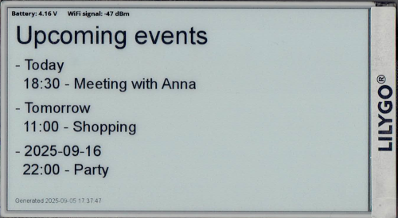

# BMP/JPG display for 4.7" LilyGo E-Paper 

This small PlatformIO program allows you to display BMP or JPG images from online location (HTTP/S server) and update it every x minutes - 60 by default. This approach lets you create info panels using other tools and show them easily on your LilyGo T5 display.

## Note
It supports only older version of LilyGo T5 module, the one featuring ESP-WROVER-E controller ([picture](./images/esp_wrover.png)). At least it was tested only on this one.

## Additional features
Beside downloading and displaying images, this program can gather data from DHT11 sensor (connected to PIN 15) and send it to remote server.

## Extras folder
In repository there is 'extras' folder, you can find there:
- basic implementation of data receiver written in PHP (saves received data to JSON file on POST request and displays them with simple graph on GET request),
- basic "Upcoming events" panel thats scraping data from Google Calendar using provided link (Settings > Calendar > Share link) and is outputting JPG image that can be displayed on T5 directly. Note: it is adjusted for Europe/Warsaw timezone.

## Installation
0. Deploy server scripts (based on provided ones) on your machine
1. Download PlatformIO from [here](https://platformio.org/platformio-ide)
2. Clone this repo or download .zip of it directly from this website
3. Open project with PlatformIO, let it sync (should do it automatically)
4. Open settings.h file and adjust preferences
5. Compile and upload project onto your device connected over USB cable

